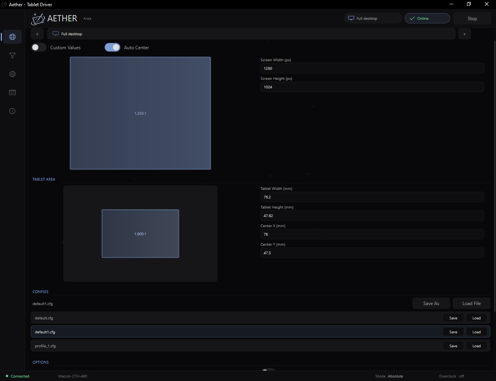
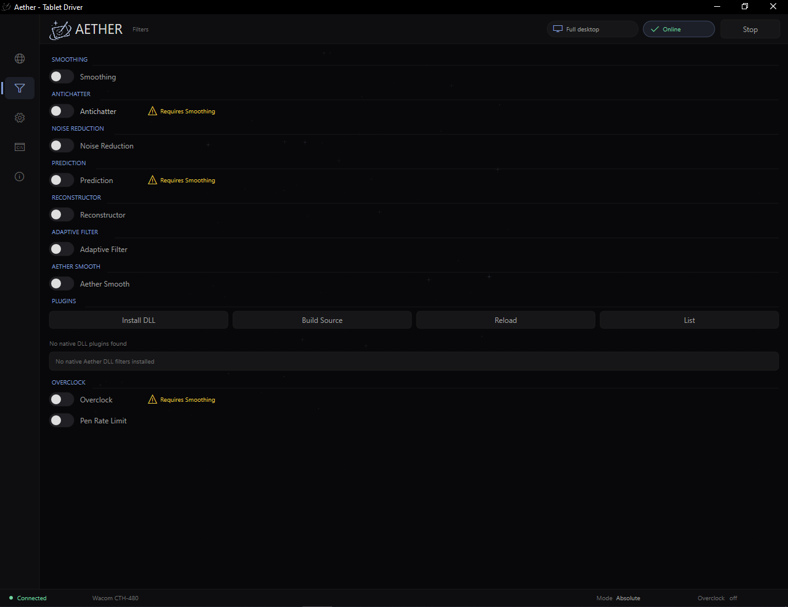
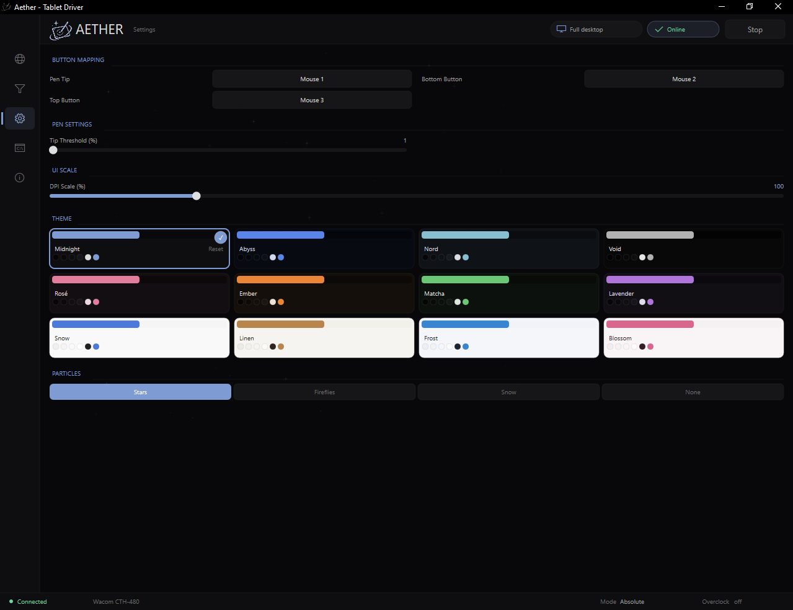

<h1>AetherGUI</h1>

  <strong>Low-latency Windows tablet driver with a native control panel</strong>
   
  Native GUI · HID / Raw Input · Wacom support · High polling output · Adaptive filtering

  
  
  
  

  AetherGUI pairs a small tablet service with a Direct2D-based interface for area mapping,
  output modes, smoothing filters, native plugin filters, profiles, and performance tuning.

  

  
  

 

<h2>· Features ·</h2>

<table align="center">
  <tr>
    <td align="center"><strong>Native Control Panel</strong> Area preview · live cursor view · profiles · themes</td>
    <td align="center"><strong>Multiple Output Modes</strong> Absolute · Relative · Windows Ink / Digitizer through VMulti</td>
  </tr>
  <tr>
    <td align="center"><strong>High Polling Output</strong> Sub-millisecond scheduling with targets up to 2000 Hz</td>
    <td align="center"><strong>Advanced Filters</strong> Smoothing · antichatter · noise reduction · adaptive prediction · Aether Smooth</td>
  </tr>
  <tr>
    <td align="center"><strong>Embedded Tablet Configs</strong> Fallback device database when external configs are missing</td>
    <td align="center"><strong>Raw Input Fixes</strong> Relative-mode resets · invalid-position handling · reduced event coalescing</td>
  </tr>
  <tr>
    <td align="center"><strong>Native Plugin Manager</strong> Animated lists · cached catalogs · install DLL filters · build source ports</td>
    <td align="center"><strong>Modern Quality-of-Life</strong> Multi-monitor mapping · DPI scaling · undo · autosave · input visualizer</td>
  </tr>
</table>

 

<h2>· Supported Tablets ·</h2>

  AetherGUI includes an embedded tablet database for common Wacom, XP-Pen, Huion, Gaomon, Parblo, UGEE, Artisul, UC-Logic, Monoprice, and related tablets.
  Some Wacom models include extra matching rules for official Wacom-driver HID interfaces.
  Newer Wacom IntuosV2 entries use expanded built-in matching data.

<table align="center">
  <tr>
    <th align="center">Brand</th>
    <th align="center">Models</th>
  </tr>
  <tr>
    <td align="center"><strong>Wacom Bamboo / One / Graphire</strong></td>
    <td align="center">
      CTE-450 · CTE-650 · CTL-460 · CTL-470 · CTL-471 · CTL-472 · CTL-480 · CTL-490 · CTL-660 · CTL-671 · CTL-672 · CTL-680 · CTL-690 
      CTH-460 · CTH-460(A) · CTH-461 · CTH-461(A) · CTH-461SE · CTH-470 · CTH-480 · CTH-490 · CTH-661 · CTH-661(A) · CTH-661SE · CTH-670 · CTH-680 · CTH-690 
      CTT-460 · MTE-450
    </td>
  </tr>
  <tr>
    <td align="center"><strong>Wacom Intuos / Intuos Pro</strong></td>
    <td align="center">
      CTL-4100 · CTL-4100WL · CTL-6100 · CTL-6100WL · PTK-440 · PTK-450 · PTK-650 
      PTH-450 · PTH-451 · PTH-460 · PTH-650 · PTH-651 · PTH-660 · PTH-850 · PTH-851 · PTH-860
    </td>
  </tr>
  <tr>
    <td align="center"><strong>Wacom Cintiq / Pen Display</strong></td>
    <td align="center">
      DTC-121 · DTC-133 · DTH-1320 · DTK-1660 · Cintiq Pro 22 DTH-227 · Cintiq Pro 27 DTH-271
    </td>
  </tr>
  <tr>
    <td align="center"><strong>XP-Pen</strong></td>
    <td align="center">
      Artist 10 / 10S · Artist 12 / 12 Pro / 12 2nd Gen · Artist 13 / 13.3 / 13.3 Pro / 13.3 Pro V2 · Artist 15.6 / 15.6 Pro / 15.6 Pro V2 
      Artist 16 / 16 Pro / 16 2nd Gen · Artist 22 / 22HD / 22R Pro · Artist 24 / 24 Pro · Artist Pro 14 / 16 / 16TP / 19 / 22 / 24 
      Deco 01 / 01 V2 / 01 V3 · Deco 02 · Deco 03 · Deco 640 · Deco Fun CT430 / CT640 / CT1060 · Deco L / LW / M / MW 
      Deco mini4 / mini7 / mini7W V2 · Deco Pro Small / Medium / SW / MW / LW Gen2 / MW Gen2 / XLW Gen2 · Innovator 16 
      Star 02 / 03 / 03 Pro / 03 V2 · Star 05 V3 · Star 06 / 06C · Star G430 / G430S / G430S V2 · G540 / G540 Pro · G640 / G640S · G960 / G960S / G960S Plus
    </td>
  </tr>
  <tr>
    <td align="center"><strong>Huion</strong></td>
    <td align="center">
      420 · 1060 Plus · G10T · G930L · GC610 · GT-156HD V2 · GT-191 V2 · GT-220 V2 · GT-221 / GT-221 Pro 
      H1060P · H1061P · H1161 · H320M · H420 / H420X · H430P · H580X · H610 Pro / V2 / V3 · H610X · H640P · H641P · H642 · H690 · H950P / H951P 
      HC16 · HS610 · HS611 · HS64 · HS95 · Kamvas 12 / 13 / 16 / 20 / 22 / 24 · Kamvas Pro 12 / 13 / 16 / 19 / 20 / 22 / 24 / 27 · Q11K / Q620M / Q630M · WH1409 · osu!tablet
    </td>
  </tr>
  <tr>
    <td align="center"><strong>Parblo</strong></td>
    <td align="center">
      A609 · A610 · A610 Pro · A610 Pro Variant 2 · A640 · A640 V2 
      Intangbo M · Intangbo S · Intangbo SW · Ninos M · Ninos N4 · Ninos N7 · Ninos N7B · Ninos S
    </td>
  </tr>
  <tr>
    <td align="center"><strong>Gaomon</strong></td>
    <td align="center">
      1060 Pro · GM116HD · GM156HD · M5 · M6 · M7 · M8 · M8 Variant 2 · M10K · M10K Pro 
      M106K · M106K Pro · M1220 · M1230 · PD1161 · PD1320 · PD156 Pro · PD1560 · PD1561 · PD2200 · S56K · S620 · S630 · S830
    </td>
  </tr>
  <tr>
    <td align="center"><strong>Other UC-Logic family</strong></td>
    <td align="center">
      Adesso Cybertablet K8 · Artisul A1201 / AP604 / D16 Pro / D22S / M0610 Pro · KENTING K5540 · LetSketch WP9620C 
      Monoprice 10594 / MP1060-HA60 · Turcom TS-6580 · UC-Logic 1060N / PF1209 / TWMNA62 
      UGEE M708 / M708 V2 / M708 V3 / M808 / M908 / S1060 / S640 / U1200 / U1600 / UE16 · VEIKK A30
    </td>
  </tr>
</table>

 

<h2>· Feature Notes ·</h2>

<table align="center">
  <tr>
    <th align="center">Feature</th>
    <th align="center">Status / Notes</th>
  </tr>
  <tr>
    <td align="center"><strong>Absolute / Relative output</strong></td>
    <td align="center">Primary supported modes for gameplay and desktop cursor control.</td>
  </tr>
  <tr>
    <td align="center"><strong>Windows Ink / Digitizer</strong></td>
    <td align="center">Requires the optional <a href="https://silentlag.s-ul.eu/rWK8xAqA">VMulti driver</a>.</td>
  </tr>
  <tr>
    <td align="center"><strong>High polling / overclock</strong></td>
    <td align="center">Targets up to 2000 Hz and runs independently from Pen Rate Limit. If a game stutters or frame time spikes, try 1000 Hz or 1500 Hz.</td>
  </tr>
  <tr>
    <td align="center"><strong>Pressure and pen buttons</strong></td>
    <td align="center">Supported for configured report parsers. Button layout can vary by model and driver mode.</td>
  </tr>
  <tr>
    <td align="center"><strong>Touch, wheels, and auxiliary buttons</strong></td>
    <td align="center">Model-specific. Pen input is the main compatibility target; extra controls may need per-device tuning.</td>
  </tr>
  <tr>
    <td align="center"><strong>Official vendor drivers</strong></td>
    <td align="center">Some drivers expose different HID interfaces or block access. Check the Console tab for HID diagnostics if detection fails.</td>
  </tr>
  <tr>
    <td align="center"><strong>Unknown Wacom variants</strong></td>
    <td align="center">The Console prints VID/PID, usage, and input report length so missing variants can be added quickly.</td>
  </tr>
  <tr>
    <td align="center"><strong>Native plugin filters</strong></td>
    <td align="center">Aether DLL plugins can expose sliders/toggles through metadata and are applied in the packet filter pipeline.</td>
  </tr>
  <tr>
    <td align="center"><strong>Pen Rate Limit</strong></td>
    <td align="center">Can cap normal packet-driven output without taking over the Overclock timer, so 2000 Hz overclock remains active when both are enabled.</td>
  </tr>
  <tr>
    <td align="center"><strong>GitHub plugin catalog</strong></td>
    <td align="center">The Plugin Manager can list Aether source filters and mapped OpenTabletDriver plugin ports from a configurable repository source, with HTTP caching to reduce repeated loading stalls.</td>
  </tr>
</table>

 

<h2>· Plugin System ·</h2>

  AetherGUI includes a native plugin pipeline for custom packet filters. Plugins are installed into the local
  <code>plugins/</code> folder next to the built application and can be enabled, disabled, configured, reloaded, or removed from the GUI.

<table align="center">
  <tr>
    <th align="center">Action</th>
    <th align="center">What it does</th>
  </tr>
  <tr>
    <td align="center"><strong>Install DLL</strong></td>
    <td align="center">Copies a native Aether plugin DLL into an isolated plugin folder and reloads filters.</td>
  </tr>
  <tr>
    <td align="center"><strong>Build Source</strong></td>
    <td align="center">Builds a plugin source folder using a PowerShell build script, Visual Studio project/solution, or .NET project when available.</td>
  </tr>
  <tr>
    <td align="center"><strong>Plugin Manager</strong></td>
    <td align="center">Browses installed filters, Aether source filters, and available OTD source ports with animated list transitions and source/wiki links.</td>
  </tr>
  <tr>
    <td align="center"><strong>Plugin metadata</strong></td>
    <td align="center">Plugins can expose option metadata so the GUI automatically creates sliders and toggles.</td>
  </tr>
  <tr>
    <td align="center"><strong>Catalog cache</strong></td>
    <td align="center">GitHub API/raw responses are cached during the session, and OTD metadata loading is capped per refresh to keep the UI more responsive.</td>
  </tr>
</table>

 

<h2>· Project Layout ·</h2>

<table align="center">
  <tr>
    <th align="center">Path</th>
    <th align="center">Purpose</th>
  </tr>
  <tr>
    <td align="center"><code>AetherGUI/</code></td>
    <td align="center">Native Direct2D control panel and renderer</td>
  </tr>
  <tr>
    <td align="center"><code>AetherService/</code></td>
    <td align="center">Tablet reader, filters, mapper, and output backend</td>
  </tr>
  <tr>
    <td align="center"><code>AetherGUI.sln</code></td>
    <td align="center">Visual Studio solution</td>
  </tr>
</table>

 

<h2>· Requirements ·</h2>

  Windows 10 / 11 · Visual Studio 2022 or newer · Windows SDK
   
  Optional: <a href="https://silentlag.s-ul.eu/rWK8xAqA">VMulti driver</a> for Windows Ink / Digitizer output

 

<h2>· Building ·</h2>

  Open <code>AetherGUI.sln</code> in Visual Studio and build:

<table align="center">
  <tr>
    <td align="center"><strong>Configuration</strong> <code>Release</code></td>
    <td align="center"><strong>Platform</strong> <code>x64</code></td>
  </tr>
</table>

  Common output folder: <code>bin/Release/</code>
   
  Service output is also available from the Visual Studio project output folder and is copied next to the GUI when possible.

 

<h2>· Usage ·</h2>

  Build the solution · Start <code>AetherGUI.exe</code> · Select output mode and tablet area
   
  Tune filters, overclock settings, and native/plugin filters from the GUI

<table align="center">
  <tr>
    <th align="center">Step</th>
    <th align="center">Recommended flow</th>
  </tr>
  <tr>
    <td align="center"><strong>1</strong></td>
    <td align="center">Open the app and let the service detect your tablet. Check the Console tab if detection fails.</td>
  </tr>
  <tr>
    <td align="center"><strong>2</strong></td>
    <td align="center">Choose Absolute, Relative, or Windows Ink output depending on the game/application.</td>
  </tr>
  <tr>
    <td align="center"><strong>3</strong></td>
    <td align="center">Select the target monitor or full desktop, then adjust the tablet area preview.</td>
  </tr>
  <tr>
    <td align="center"><strong>4</strong></td>
    <td align="center">Enable smoothing, Aether Smooth, prediction, adaptive filtering, overclock, Pen Rate Limit, or native plugins as needed.</td>
  </tr>
  <tr>
    <td align="center"><strong>5</strong></td>
    <td align="center">Save profiles from the Area page. Autosave keeps the current setup between launches.</td>
  </tr>
</table>

  For games that use raw input, test both Absolute and Relative modes.
  Keep the overclock value at the highest rate your system can handle without frame-time spikes.
  Pen Rate Limit can be used separately for normal packet output; when Overclock is enabled, Overclock remains the active high-rate output timer.

 

<h2>· Notes ·</h2>

  Some Wacom tablets expose different HID interfaces depending on whether official Wacom drivers are installed.
   
  If detection fails, check the GUI console for <code>Tablet found!</code> and HID warning lines.
   
  If 2000 Hz causes stutter, try 1500 Hz or 1000 Hz for a steadier frame time.
   
  Native plugins are loaded from local DLLs. Only install plugins from sources you trust.

 

<h2>· Troubleshooting ·</h2>

<table align="center">
  <tr>
    <th align="center">Problem</th>
    <th align="center">Try this</th>
  </tr>
  <tr>
    <td align="center"><strong>Tablet is not detected</strong></td>
    <td align="center">Open Console, run HID diagnostics, and check whether another vendor driver is blocking the HID interface.</td>
  </tr>
  <tr>
    <td align="center"><strong>Windows Ink does not work</strong></td>
    <td align="center">Install VMulti and restart AetherGUI. Absolute and Relative modes do not require VMulti.</td>
  </tr>
  <tr>
    <td align="center"><strong>Cursor feels jittery</strong></td>
    <td align="center">Try Noise Reduction, Aether Smooth, Adaptive Filter, or a native smoothing plugin.</td>
  </tr>
  <tr>
    <td align="center"><strong>Game stutters at high Hz</strong></td>
    <td align="center">Lower overclock target to 1000-1500 Hz. Pen Rate Limit can help normal output, but it no longer takes over the Overclock rate.</td>
  </tr>
  <tr>
    <td align="center"><strong>Plugin does not appear</strong></td>
    <td align="center">Use Reload in the Plugin Manager and verify the DLL exports the Aether plugin API.</td>
  </tr>
  <tr>
    <td align="center"><strong>OTD Ports tab loads slowly</strong></td>
    <td align="center">Press Refresh only when needed. Catalog responses are cached during the session, and metadata requests are limited to reduce UI stalls.</td>
  </tr>
</table>

 

<h2>· Credits ·</h2>

  Inspired by Devocub Tablet Driver.
   
  Community tablet metadata and testing reports helped improve device coverage.

